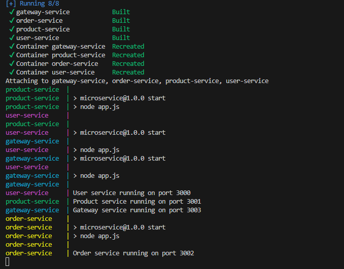
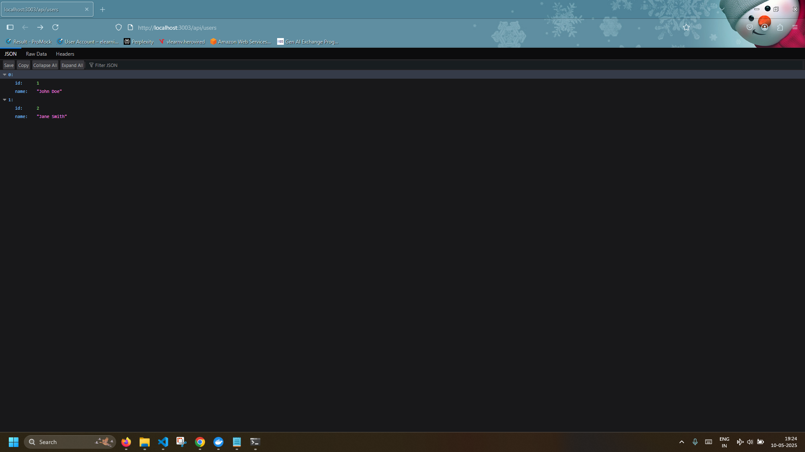
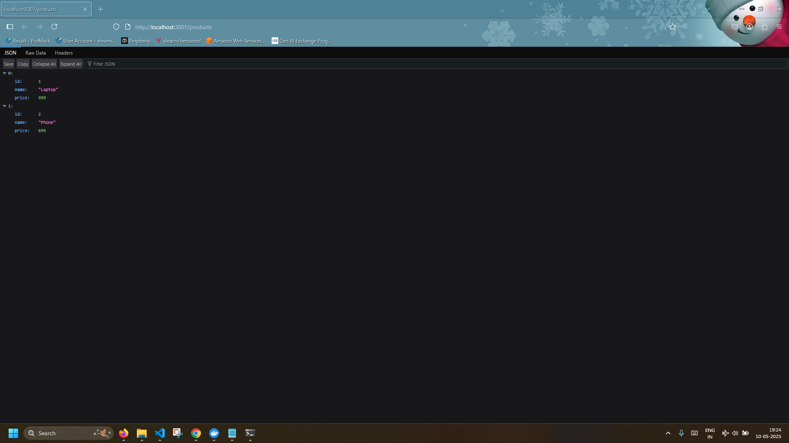
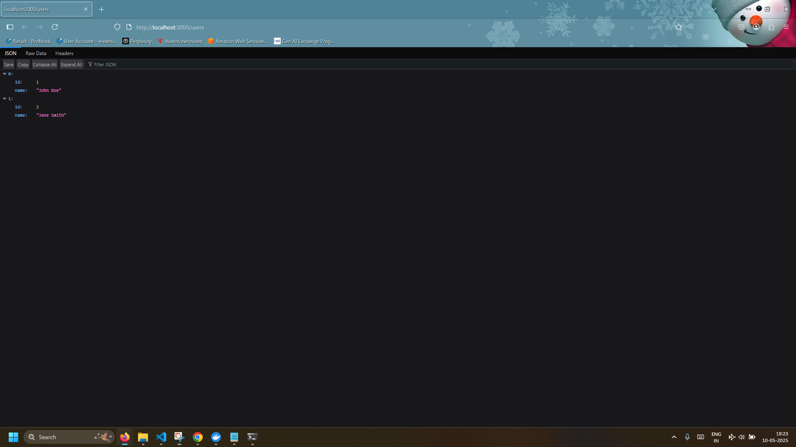

# Microservices Architecture - Node.js + Docker

This project demonstrates a microservices architecture using Node.js for building individual services. The services are containerized using Docker and orchestrated with Docker Compose.

## Project Structure

```
Microservices/
├── gateway-service/
│   ├── Dockerfile
│   ├── package.json
│   └── index.js
├── user-service/
│   ├── Dockerfile
│   ├── package.json
│   └── index.js
├── product-service/
│   ├── Dockerfile
│   ├── package.json
│   └── index.js
├── order-service/
│   ├── Dockerfile
│   ├── package.json
│   └── index.js
└── docker-compose.yml
```

## Services

* `gateway-service`: Acts as the API gateway, routing traffic to appropriate services.
* `user-service`: Manages user-related operations.
* `product-service`: Handles product catalog and details.
* `order-service`: Processes and manages orders.

## Getting Started

* Clone the repo 
* Create the ```Dockerfile``` for each service
* Create the ```docker-compose.yml```

## Sample Dockerfile of user-service

```
FROM node:18
WORKDIR /app
COPY package*.json ./
RUN npm install
COPY . .
EXPOSE 3000
CMD ["npm", "start"]
```

## Docker-compose file

```
version: '3.8'

services:
  user-service:
    build: ./user-service
    ports:
      - "3000:3000"
    restart: unless-stopped

  product-service:
    build: ./product-service
    ports:
      - "3001:3001"
    restart: unless-stopped

  order-service:
    build: ./order-service
    ports:
      - "3002:3002"
    restart: unless-stopped

  gateway-service:
    build: ./gateway-service
    ports:
      - "3003:3003"
    restart: unless-stopped

```


### Run the Services

```bash
docker-compose up --build
```

> ⚠️ Ensure that all `package.json` files in services contain a valid `start` script like:
>
> ```json
> "scripts": {
>   "start": "node index.js"
> }
> ```

### Stop the Services

```bash
docker-compose down
```

## Testing Services

After running `docker-compose up`, your services will be available on the following ports (configurable via `docker-compose.yml`):

* Gateway: `http://localhost:8080`
* User Service: `http://localhost:3001`
* Product Service: `http://localhost:3002`
* Order Service: `http://localhost:3003`


### Sucessful Terminal




### Gateway_local



### Product_local



### User_local


